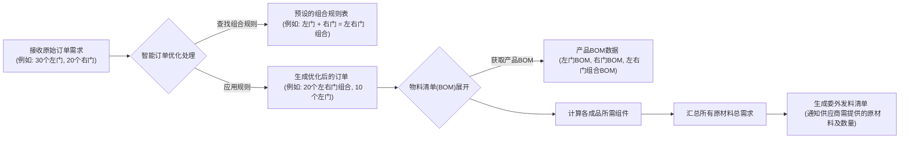

# 委外加工优化：左右门组合场景的系统逻辑解析

## 1. 核心业务场景

在我们的委外加工业务中，针对门类产品（如左门、右门），存在一个特殊的制造工艺：

*   如果供应商**单独加工一个左门**，需要提供**1份**核心原材料。
*   如果供应商**单独加工一个右门**，也需要提供**1份**核心原材料。
*   但如果供应商**同时加工一对左右门（一个左门和一个右门）**，由于工艺优化，只需要提供**1份**核心原材料就能产出这一对门。

目标：当公司需要采购多种门时，系统应能智能识别可以“配对”加工的左右门，以“左右门组合”的形式下单给供应商，从而最大限度地节省核心原材料的消耗。

## 2. 系统处理流程概览

当一个委外采购需求产生时（例如，需要30个左门和20个右门），系统会按照以下步骤处理，以实现原材料的优化：



## 3. 关键步骤详解

### 步骤一：接收原始订单需求
系统接收到需要委外加工的产品和数量。
*   **业务示例**：业务部门发起了采购30个“左门成品 (FG_DOOR_L)”和20个“右门成品 (FG_DOOR_R)”的需求。

### 步骤二：智能订单优化处理 (核心逻辑)
这是实现原材料节约的关键。系统不会直接处理原始订单，而是会先进行一次“优化组合”。

1.  **查找组合规则**：
    *   系统会查询一个预先配置好的“**组合规则表 (PairingRule)**”。这张表定义了哪些单独的产品可以被组合成一个更优的“组合产品”。
    *   **业务示例**：规则表中有一条记录：“左门成品 (FG_DOOR_L)” + “右门成品 (FG_DOOR_R)” = “左右门组合成品 (FG_DOOR_PAIR)”。

2.  **应用规则进行拆解与组合**：
    *   系统会检查订单中是否有符合规则表定义的、可以配对的产品。
    *   它会计算出根据现有数量，最多可以形成多少个“组合产品”。
    *   **业务示例**：
        *   订单中有30个左门，20个右门。
        *   根据规则，1个左门和1个右门可以组成1个“左右门组合”。
        *   系统计算出最多可以组成 `min(30, 20) = 20` 个“左右门组合”。
        *   形成20个“左右门组合”后，消耗了20个左门和20个右门。
        *   剩余：`30 - 20 = 10` 个左门，`20 - 20 = 0` 个右门。

3.  **生成优化后的订单**：
    *   原始订单被转换为一个新的、优化后的订单。
    *   **业务示例**：原始的“30个左门，20个右门”订单，被系统内部转换为“**20个左右门组合成品 (FG_DOOR_PAIR)** 和 **10个左门成品 (FG_DOOR_L)**”。

    *   **代码映射**：`SubcontractingService.optimizeOrderItems()` 方法负责这个逻辑。它会：
        *   获取原始订单项列表。
        *   从 `InMemoryDataStore.getPairingRules()` 获取所有组合规则。
        *   遍历规则，对订单中的物料进行配对和数量调整。
        *   输出一个优化后的订单项列表。

### 步骤三：物料清单 (BOM) 展开
系统会针对优化后订单中的每一个成品，查找其对应的物料清单 (BOM)。BOM 定义了生产一个成品需要哪些组件（原材料或半成品）以及各自的数量。

*   **产品BOM数据 (BillOfMaterial)**：
    *   **左门成品 (FG_DOOR_L) 的BOM**：
        *   核心原材料 (RM_CORE_001): 1 件
        *   铰链 (RM_HINGE_002): 2 件
    *   **右门成品 (FG_DOOR_R) 的BOM**：
        *   核心原材料 (RM_CORE_001): 1 件
        *   铰链 (RM_HINGE_002): 2 件
    *   **左右门组合成品 (FG_DOOR_PAIR) 的BOM**：
        *   核心原材料 (RM_CORE_001): **1 件** (这就是优化的关键点!)
        *   铰链 (RM_HINGE_002): 4 件 (左右门各2个)

*   **代码映射**：`InMemoryDataStore` 存储了这些BOM信息。`SubcontractingService.calculateRequiredMaterials()` 方法会根据优化后订单中的产品ID，从 `InMemoryDataStore` 中查找对应的BOM。

### 步骤四：原材料需求计算与汇总
系统根据优化后订单中各成品的数量及其BOM，计算出所需组件的总量。

*   **业务示例** (基于优化后的订单：20个“左右门组合”，10个“左门”)：
    *   **对于20个“左右门组合 (FG_DOOR_PAIR)”**：
        *   核心原材料：20 (组合数量) * 1 (BOM中用量) = 20 件
        *   铰链：20 * 4 = 80 件
    *   **对于10个“左门成品 (FG_DOOR_L)”**：
        *   核心原材料：10 (左门数量) * 1 (BOM中用量) = 10 件
        *   铰链：10 * 2 = 20 件
    *   **总原材料需求**：
        *   核心原材料 (RM_CORE_001)：20 + 10 = **30 件**
        *   铰链 (RM_HINGE_002)：80 + 20 = **100 件**

*   **代码映射**：`SubcontractingService.calculateRequiredMaterials()` 方法在获取BOM后，会遍历BOM中的每个组件，将其数量乘以对应成品的订单数量，然后累加到 `totalRawMaterialsNeeded` 这个Map中，最终形成 `MaterialRequirementDto` 列表。

**对比：** 如果没有优化，直接按原始订单（30个左门，20个右门）计算：
*   核心原材料：(30 * 1) + (20 * 1) = **50 件**
通过优化，核心原材料从50件减少到了30件，节约了20件。

### 步骤五：生成委外发料清单
最终，系统会输出一个清单，告知需要向供应商提供哪些原材料，以及各自的总数量。
*   **业务示例**：供应商将收到通知，需要准备接收30件核心原材料和100件铰链，用于生产20对门和10个单独的左门。

## 4. 代码关键模块与业务映射

*   **`Product.java` (产品模型)**：
    *   **业务对应**：代表系统中的物料主数据，如“左门成品”、“右门成品”、“左右门组合成品”、“核心原材料”、“铰链”等。每个产品有唯一的ID、名称和类型（成品/原材料）。
*   **`BillOfMaterial.java` (物料清单模型)**：
    *   **业务对应**：定义了一个成品的“配方”。指明生产一个该成品需要哪些“子件 (BomComponent)”以及各自的数量。
*   **`PairingRule.java` (组合规则模型)**：
    *   **业务对应**：定义了哪些“子成品”可以被组合成一个“父组合成品”，例如“左门”+“右门”=“左右门组合”。这是实现智能优化的配置基础。
*   **`InMemoryDataStore.java` (内存数据存储/模拟数据库)**：
    *   **业务对应**：相当于一个小型数据库，存储了所有的产品信息、BOM信息以及组合规则。在实际SAP集成中，这些数据会来自SAP的物料主数据、BOM主数据和自定义配置表。
*   **`SubcontractingService.java` (委外服务)**：
    *   `optimizeOrderItems()`：**智能订单优化器**。根据组合规则，将原始订单转换为更经济的组合订单。
    *   `calculateRequiredMaterials()`：**原材料需求计算器**。根据（优化后的）订单和BOM，计算出总的原材料需求。
*   **`SubcontractingController.java` (API接口)**：
    *   **业务对应**：系统的“接单窗口”。外部系统或用户通过这个接口提交委外加工订单请求。
*   **DTOs (`OrderRequestDto`, `OrderItemDto`, `MaterialRequirementDto`)**：
    *   **业务对应**：数据传输的“表单”或“文件”，用于在系统不同部分之间传递订单信息和计算结果。

## 5. 优势

*   **成本节约**：通过智能组合，显著减少核心原材料的浪费。
*   **自动化**：系统自动完成优化和计算，减少人工干预和潜在错误。
*   **灵活性**：通过配置“组合规则表”，可以方便地适应未来可能出现的新组合场景，而无需修改核心代码逻辑。
*   **流程标准化**：为委外加工的原材料计划提供了一个标准的、可重复的计算逻辑。

这种设计使得系统能够根据预设的业务规则，智能地处理委外订单，从而在满足生产需求的同时，有效地控制成本。
```。